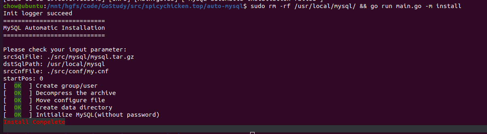
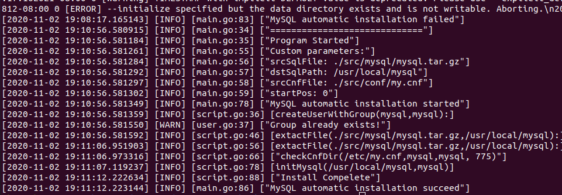

# auto-mysql(MySQL Automatic Installation)

This Project is use to automate MySQL Initializing Procedure by GOLANG


## Usage
``` bash
# SRC_FILE_FOLDER is where you put your mysql and configure file 
# DST_FILE_FOLDER is where you want to install the mysql
user@host:~/$ automysql [ -m [true/false] -s <SRC_SQL_FILE>, -d <DST_SQL_PATH>, -c <SRC_CNF_FILE> ]
```

Default value as follow

```bash
SRC_SQL_FILE = "./src/mysql.tar.gz"
DST_SQL_PATH = "/usr/local/mysql"
SRC_CNF_FILE = "./src/my.cnf"
DST_CNF_FILE = "/etc/my.cnf" # This value could not be modified by now!
```

After program finished, you should set a password for root in MySQL(Which will be automated in next version).

```bash
update mysql.user set authentication_string=password('123') 
    where user='root';
```


## Warning

1. Please **don't** assign a password for "mysql" user (e.g. **passwd mysql** )
2. Make sure the installing path can be accessed by general users(*will be automated in future*)
3. do not touch any related file while running this script


## Program Interface

User Interface



Running Log




## Further Work

1. Reconstruct shell command call
2. Deeper custom for user
3. Detailed module test


## FAQ

1.有啥用？

省点打cd,chown,mv指令的时间

2.为啥初始化完的实例root没有密码？

因为目前使用的--initialize-insecure，这个问题下一个版本就会改掉，目前没时间

3.有什么潜在的问题？

如果你把mysql装在奇奇怪怪的路径上（不保证当前用户可达的那种），初始化不一定能成功